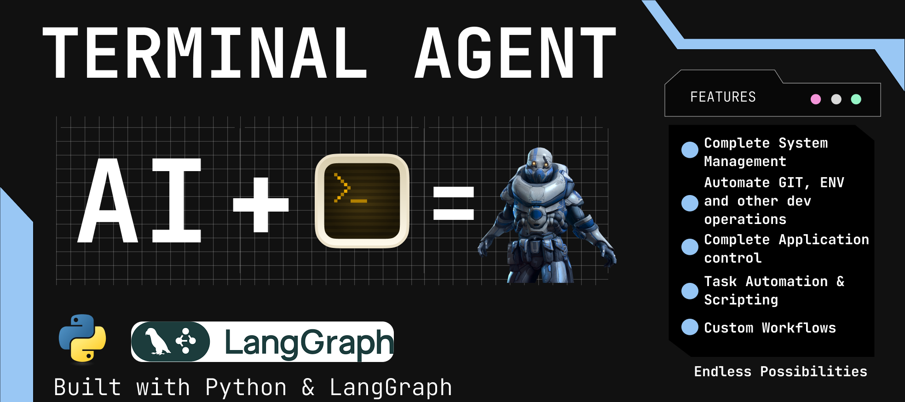

# Terminal Agent



A powerful Terminal Agent built with Python, LangGraph, and LangChain, designed for seamless command execution across multiple operating systems. By default, it uses PowerShell for Windows, but it can be adapted to use `bash` or other shells for Linux/macOS, making it a fast and reliable tool for terminal automation.

## Features

- **Complete System Management**: Handle processes, files, directories, system info, resource usage, settings, and task scheduling.
- **Automate GIT, ENV, and Other Dev Operations**: Initialize Git repos, manage virtual environments, install packages, run build scripts, and debug code.
- **Complete Application Control**: Launch and automate applications, manage services, and software.
- **Task Automation & Scripting**: Write and run scripts, automate repetitive tasks like backups or log management.
- **Custom Workflows**: Create integrations, monitor system status, and send alerts.
- **Networking**: Manage adapters, query configurations, and run diagnostics like ping or traceroute.
- **Security**: Manage system security tools and check for vulnerabilities.

## Abilities

The Terminal Agent is equipped with a wide range of capabilities to streamline your workflow:

- **System Management**:
  - Manage processes (start, stop, query).
  - Manage files and directories (create, delete, move, copy).
  - Retrieve system info and resource usage (CPU, RAM, disk).
  - Configure system settings and environment variables.
  - Schedule tasks.

- **Development Operations**:
  - Initialize and manage Git repositories.
  - Create and manage virtual environments for programming languages like Python.
  - Install, update, and manage packages (for Python, Node.js, etc.).
  - Run build scripts and automation workflows.
  - Execute and debug code.

- **Networking**:
  - Manage network adapters and connections.
  - Query network configurations and statistics.
  - Run diagnostics (ping, traceroute, etc.).

- **Automation and Scripting**:
  - Write, schedule, and run scripts (PowerShell on Windows, bash on Linux/macOS).
  - Automate repetitive tasks (file backups, log management).
  - Interface with APIs via command-line tools or invoke HTTP requests.

- **Application Control**:
  - Launch, interact with, and automate applications.
  - Manage services and installed software.

- **Security**:
  - Manage system security tools (e.g., Windows Defender on Windows).
  - Check for vulnerabilities or security settings.

- **Custom Workflows**:
  - Combine multiple steps to create custom workflows or integrations.
  - Monitor system or application status and send alerts or notifications.

## Cross-Platform Support

While the Terminal Agent is configured for Windows with PowerShell by default, it can be adapted to work on Linux or macOS by modifying the shell used in `terminal_controller.py`. To switch to `bash`:

1. Open `terminal_controller.py`.
2. In the `Process` class, update the `subprocess.Popen` call to use `bash` instead of `powershell.exe`:

```python
self.process = subprocess.Popen(
    ['bash'],
    stdin=subprocess.PIPE,
    stdout=subprocess.PIPE,
    stderr=subprocess.PIPE,
    text=True,
    bufsize=1
)
```

3. Remove the PowerShell-specific arguments (`-NoProfile`, `-ExecutionPolicy`, `Bypass`) since they are not applicable to bash.
4. Adjust the agent's logic in the system prompt to use bash commands instead of PowerShell commands. For example, replace `Write-Output` with `echo` in the `send_command` method:

```python
wrapped_cmd = f"""
echo "{start_marker}"
{cmd}
echo "{end_marker}"
"""
```

> Note: Some commands and features (e.g., Windows Defender management) are Windows-specific and will need alternative implementations for other operating systems. Ensure the commands you use are compatible with the target shell and OS.

## Using a Custom LLM Provider with LangChain

The Terminal Agent uses LangChain's `ChatOpenAI` by default, but you can configure it to use any LLM provider supported by LangChain (e.g., Anthropic, Hugging Face, Azure OpenAI, etc.). To use a custom LLM provider, modify the LLM setup in the main script.

### Example: Using Anthropic's Claude Model

Install the required LangChain package for your provider (e.g., for Anthropic):

```bash
pip install langchain-anthropic
```

Update the LLM configuration in the script. Replace the `ChatOpenAI` setup with your custom provider. For Anthropic's Claude model, modify the code as follows:

```python
from langchain_anthropic import ChatAnthropic

# Replace the existing llm setup
llm = ChatAnthropic(
    model_name="claude-3-sonnet-20240229",
    anthropic_api_key="your-anthropic-api-key"
).bind_tools(tools)
```

Set your API key in your environment variables or directly in the script. For example, using a `.env` file:

```
ANTHROPIC_API_KEY=your-anthropic-api-key
```

> Ensure the system prompt and tools are compatible with your chosen LLM provider, as some providers may have different token limits or tool-calling capabilities.

### Supported Providers

LangChain supports a variety of LLM providers. Some popular options include:

- **Anthropic**: Use `langchain-anthropic` for Claude models.
- **Hugging Face**: Use `langchain-huggingface` for open-source models.
- **Azure OpenAI**: Use `langchain-openai` with Azure-specific configurations.
- **Google Vertex AI**: Use `langchain-google-vertexai`.

Refer to the LangChain documentation for a full list of supported providers and their setup instructions.

## Getting Started

### Prerequisites

- Python 3.8+
- PowerShell (for Windows) or bash (for Linux/macOS)
- Required Python packages (listed in `requirements.txt`)

### Installation

Clone the repository:

```bash
git clone https://github.com/[your-username]/terminal-agent.git
cd terminal-agent
```

Install dependencies:

```bash
pip install -r requirements.txt
```

Set up your environment variables in a `.env` file (if required).

(Optional) If running on Linux/macOS, follow the steps in the **Cross-Platform Support** section to switch to `bash`.

(Optional) If using a custom LLM provider, follow the steps in the **Using a Custom LLM Provider with LangChain** section.

### Usage

Run the agent:

```bash
python main.py
```

Enter your commands when prompted. Type `exit` to quit.

## Contributing

Contributions are welcome! Please fork the repository, create a new branch, and submit a pull request with your changes.

## License

This project is licensed under the MIT License - see the LICENSE file for details.

## Acknowledgments

- Built with LangGraph and LangChain.
- Inspired by the need for efficient terminal automation across operating systems.